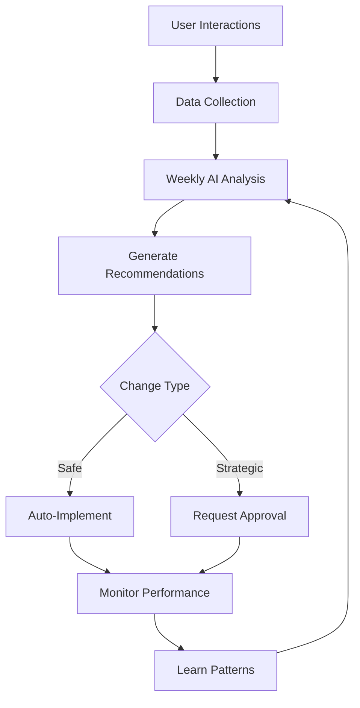
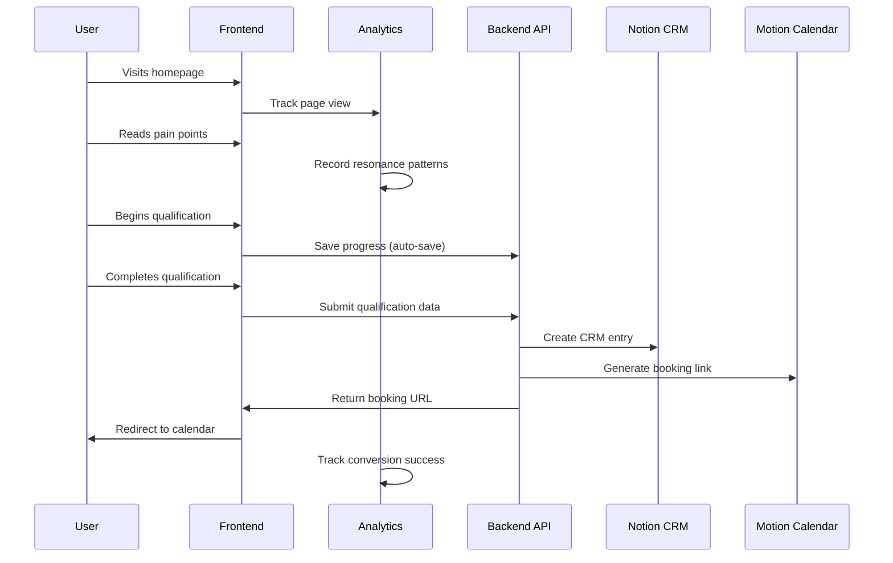
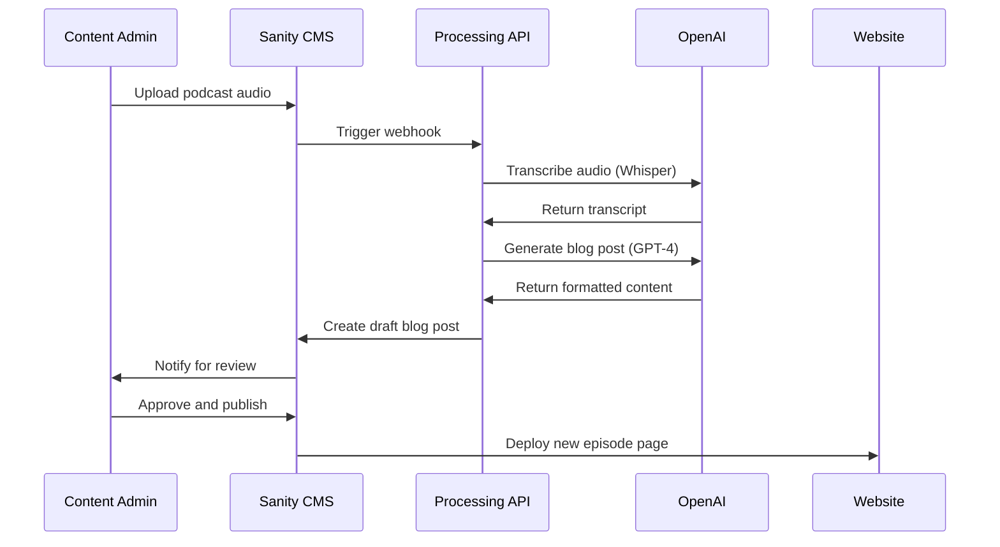
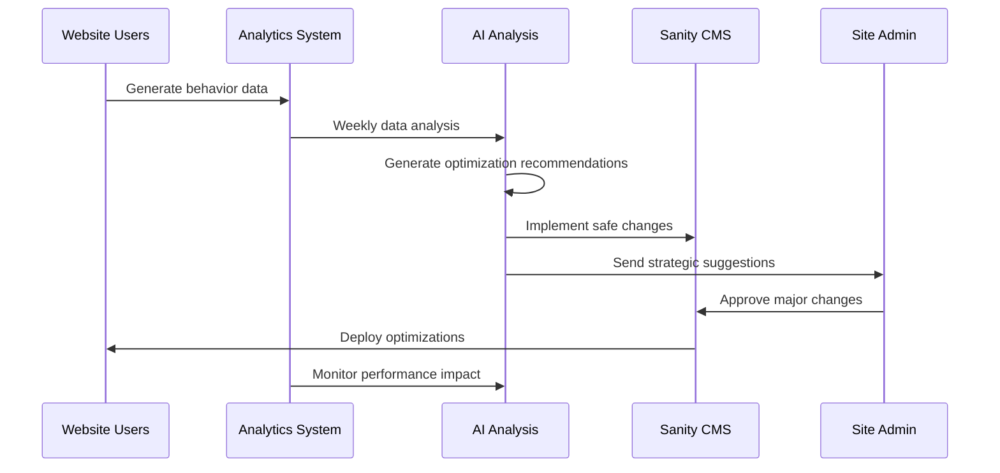

# The Wisdom Practice Website Full-Stack Architecture

**Generated by:** Architect Agent (Winston)  
**Date:** 2025-01-17  
**Project:** TWP_website  
**Methodology:** Enhanced BMAD with AI Optimization

## Executive Summary

The Wisdom Practice website implements a sophisticated JAMstack architecture with AI-driven optimization capabilities, designed for psychology-based coaching conversion and mobile-first psychological content consumption. The system features automated podcast processing, advanced CMS management, comprehensive analytics, and self-improving optimization through AI feedback loops.

## High Level Architecture

### Technical Summary

The Wisdom Practice website is built as a high-performance JAMstack application featuring Next.js 14 with App Router for optimal mobile performance, Sanity CMS for flexible content management, and AI-driven optimization system for continuous improvement. The architecture prioritizes Core Web Vitals (<2.5s LCP, <100ms FID, <0.1 CLS) while supporting complex psychological content consumption patterns and sophisticated user qualification flows.

Key innovations include automated podcast transcription and publishing pipeline, "contemplative mobile" interaction patterns for psychological processing, AI-powered website optimization based on user behavior analysis, and future-ready architecture supporting membership and course scaling.

### Platform and Infrastructure Choice

**Platform:** Vercel (Frontend) + Sanity (CMS) + Supabase (Database) + AI Optimization Pipeline
**Key Services:** 
- Next.js hosting with Edge Runtime
- Sanity Studio for visual content management
- Supabase for user data and future authentication
- OpenAI GPT-4 for content processing and optimization analysis
- Microsoft Clarity for heat maps and session recording
- Plausible Analytics for privacy-friendly user tracking

**Deployment Host and Regions:** Vercel Global Edge Network with primary database in EU-West for GDPR compliance

### Repository Structure

**Structure:** Turborepo monorepo with apps/web (frontend), apps/api (serverless functions), packages/shared (types), packages/ui (components)
**Monorepo Tool:** Turborepo for optimal Vercel integration
**Package Organization:** Feature-based organization supporting podcast automation, qualification system, and AI optimization

## Technology Stack

| Category | Technology | Version | Purpose | Rationale |
|----------|------------|---------|---------|-----------|
| Frontend Language | TypeScript | 5.0+ | Type-safe development | Essential for complex form logic and API integration |
| Frontend Framework | Next.js | 14.0+ | React framework with App Router | Optimal performance, SSR, and Vercel integration |
| UI Component Library | Custom + Radix UI | Latest | Accessible component primitives | Full control over "masculine mindfulness" aesthetic |
| State Management | Zustand | 4.0+ | Lightweight state management | Perfect for qualification form state persistence |
| Backend Language | TypeScript | 5.0+ | Serverless functions | Shared types between frontend and backend |
| Backend Framework | Next.js API Routes | 14.0+ | Serverless API functions | Seamless integration with frontend |
| API Style | REST + Webhooks | - | Simple integration pattern | Third-party service compatibility |
| Database | Supabase PostgreSQL | Latest | User data and analytics | Scalable, auth-ready, real-time capabilities |
| Cache | Vercel Edge Cache | - | Static content delivery | Global performance optimization |
| File Storage | Sanity Assets | - | Images and podcast files | Integrated with CMS, automatic optimization |
| Authentication | Supabase Auth | Latest | Future user accounts | Ready for membership features |
| Frontend Testing | Vitest + Testing Library | Latest | Component and integration testing | Modern, fast testing framework |
| Backend Testing | Jest + Supertest | Latest | API endpoint testing | Established Node.js testing patterns |
| E2E Testing | Playwright | Latest | Conversion funnel testing | Critical for qualification flow validation |
| Build Tool | Turborepo | Latest | Monorepo build orchestration | Optimal caching and parallelization |
| Bundler | Next.js/Turbopack | Latest | Fast development builds | Integrated with framework |
| CSS Framework | Stitches | Latest | Performance CSS-in-JS | Zero-runtime styling with design tokens |
| CI/CD | Vercel + GitHub Actions | Latest | Automated deployment and testing | Integrated platform deployment |
| Monitoring | Vercel Analytics + Plausible | Latest | Performance and user analytics | Privacy-compliant monitoring |
| Logging | Vercel Functions Logs | - | Error tracking and debugging | Built-in serverless logging |
| CMS | Sanity Studio | Latest | Visual content management | Flexible, developer-friendly headless CMS |

## AI Optimization System Architecture

### Core Components

**1. Data Collection Layer**
- Microsoft Clarity: Heat maps, session recordings, scroll depth analysis
- Plausible Analytics: Conversion funnel tracking, privacy-compliant user behavior
- Custom Event Tracking: Pain point resonance scoring, qualification abandonment points
- Form Analytics: Question hesitation patterns, completion rate analysis
- A/B Test Performance: Automated variant success measurement

**2. AI Analysis Engine**
- GPT-4 integration with coaching psychology context
- Weekly behavior pattern analysis
- Content effectiveness scoring
- User journey optimization recommendations  
- Mobile vs desktop interaction pattern analysis

**3. Automated Implementation System**
- Level 1 (Automatic): Animation timing, A/B test management, content reordering
- Level 2 (Approval Required): Content rewrites, layout changes, new qualification questions
- Level 3 (Strategic): New feature recommendations, membership prioritization

**4. Performance Monitoring**
- Before/after comparison tracking
- Conversion rate impact measurement
- User satisfaction score changes
- Performance regression detection
- Automatic rollback triggers

### AI Optimization Workflow



## Data Models

### User Qualification Model
```typescript
interface QualificationResponse {
  id: string;
  email: string;
  responses: {
    questionId: string;
    answer: string;
    hesitationTime: number;
    completedAt: Date;
  }[];
  qualificationScore: number;
  psychologyPatterns: string[];
  conversionLikelihood: number;
  createdAt: Date;
}
```

### Analytics Data Model
```typescript
interface UserBehaviorData {
  sessionId: string;
  userId?: string;
  pageViews: PageView[];
  interactions: Interaction[];
  conversionEvents: ConversionEvent[];
  painPointResonance: {
    painPointId: string;
    timeSpent: number;
    scrollDepth: number;
    interactionCount: number;
  }[];
}
```

### Podcast Content Model
```typescript
interface PodcastEpisode {
  id: string;
  title: string;
  audioFile: SanityAsset;
  transcript: string;
  blogPost: {
    content: PortableText;
    seoTitle: string;
    metaDescription: string;
    featuredImage: SanityAsset;
  };
  publishedAt: Date;
  spotifyUrl: string;
  tags: string[];
}
```

## Component Architecture

### Frontend Components

**1. Psychology Content Components**
- `PainPointCard`: Individual psychological experience recognition
- `ParadigmShiftSection`: Core insight delivery with contemplative pacing
- `QualificationFlow`: Multi-step therapeutic-style form
- `ContemplativeLoader`: Grounded loading states supporting processing time

**2. CMS-Driven Components**  
- `DynamicContent`: Sanity-powered flexible content blocks
- `PodcastGrid`: Automated episode display with SEO optimization
- `BlogPost`: Transcript-to-blog-post rendering with rich formatting

**3. Analytics Components**
- `BehaviorTracker`: Heat map and interaction data collection
- `ConversionFunnel`: Stage-by-stage analytics tracking
- `A/BTestWrapper`: Automated variant testing framework

### Backend Services

**1. Content Processing Service**
- Podcast transcription automation (Whisper API integration)
- AI-powered blog post generation from transcripts
- SEO optimization and meta data generation
- Image suggestion and placement automation

**2. Analytics Service** 
- User behavior data aggregation
- AI analysis pipeline coordination
- Performance monitoring and alerting
- A/B test management and results processing

**3. Optimization Service**
- GPT-4 integration for content analysis
- Automated change implementation
- Performance impact measurement
- Learning pattern storage and application

## External API Integrations

### Motion Calendar API
- **Purpose:** Simplified booking link generation
- **Integration:** Generate personalized booking URLs based on qualification data
- **Fallback:** Manual booking form for API failures
- **Rate Limits:** Standard SaaS limits, cached booking links

### Notion API
- **Purpose:** CRM data storage and lead management
- **Integration:** Webhook-based form submission processing
- **Data Flow:** Qualification responses → Structured Notion database entries
- **Error Handling:** Retry logic with local backup storage

### Spotify API
- **Purpose:** Podcast episode embedding and metadata
- **Integration:** Episode URL embedding in blog posts
- **Fallback:** Direct Spotify links if embedding fails
- **Rate Limits:** Public API limits, cached episode data

### OpenAI API
- **Purpose:** Transcript processing and optimization analysis
- **Integration:** Automated content generation and user behavior analysis
- **Cost Management:** Weekly batch processing, prompt optimization
- **Fallback:** Manual content creation if API unavailable

## Core Workflows

### User Qualification Journey


### Podcast Publishing Automation


### AI Optimization Cycle


## Database Schema

### User Analytics Schema
```sql
-- User behavior tracking
CREATE TABLE user_sessions (
    id UUID PRIMARY KEY DEFAULT gen_random_uuid(),
    session_id VARCHAR(255) UNIQUE NOT NULL,
    user_agent TEXT,
    country VARCHAR(2),
    device_type VARCHAR(50),
    created_at TIMESTAMP DEFAULT NOW()
);

-- Pain point interaction tracking
CREATE TABLE pain_point_interactions (
    id UUID PRIMARY KEY DEFAULT gen_random_uuid(),
    session_id UUID REFERENCES user_sessions(id),
    pain_point_id VARCHAR(100),
    time_spent INTEGER, -- milliseconds
    scroll_depth DECIMAL(5,2), -- percentage
    interaction_count INTEGER,
    created_at TIMESTAMP DEFAULT NOW()
);

-- Qualification form responses
CREATE TABLE qualification_responses (
    id UUID PRIMARY KEY DEFAULT gen_random_uuid(),
    session_id UUID REFERENCES user_sessions(id),
    email VARCHAR(255),
    responses JSONB,
    qualification_score INTEGER,
    psychology_patterns TEXT[],
    conversion_likelihood DECIMAL(5,2),
    completed_at TIMESTAMP,
    created_at TIMESTAMP DEFAULT NOW()
);
```

### Content Management Schema (Sanity)
```typescript
// Sanity schema definitions
const painPoint = {
  name: 'painPoint',
  type: 'document',
  fields: [
    { name: 'title', type: 'string' },
    { name: 'description', type: 'text' },
    { name: 'order', type: 'number' },
    { name: 'psychologyTags', type: 'array', of: [{ type: 'string' }] }
  ]
};

const podcastEpisode = {
  name: 'podcastEpisode', 
  type: 'document',
  fields: [
    { name: 'title', type: 'string' },
    { name: 'audioFile', type: 'file' },
    { name: 'transcript', type: 'text' },
    { name: 'blogContent', type: 'array', of: [{ type: 'block' }] },
    { name: 'seoTitle', type: 'string' },
    { name: 'metaDescription', type: 'text' },
    { name: 'spotifyUrl', type: 'url' },
    { name: 'publishedAt', type: 'datetime' }
  ]
};
```

## Frontend Architecture

### Component Organization
```
apps/web/src/
├── components/
│   ├── psychology/          # Pain point cards, qualification flow
│   ├── content/             # CMS-driven content components
│   ├── analytics/           # Behavior tracking components
│   └── ui/                  # Base UI components
├── pages/                   # Next.js pages/routing
├── hooks/                   # Custom React hooks for state management
├── services/                # API client services
├── stores/                  # Zustand stores for complex state
├── styles/                  # Stitches styling system
└── utils/                   # Frontend utilities
```

### State Management Architecture
```typescript
// Qualification form state with persistence
interface QualificationState {
  currentStep: number;
  responses: Record<string, any>;
  startedAt: Date;
  lastSavedAt: Date;
  email?: string;
}

// Global app state
interface AppState {
  qualification: QualificationState;
  analytics: AnalyticsState;
  user: UserState;
  ui: UIState;
}
```

## Backend Architecture

### Serverless Function Organization
```
apps/web/api/
├── qualification/
│   ├── submit.ts            # Handle qualification form submission
│   ├── save-progress.ts     # Auto-save functionality
│   └── get-progress.ts      # Resume incomplete qualification
├── analytics/
│   ├── track-event.ts       # Custom event tracking
│   ├── collect-data.ts      # Aggregate weekly data
│   └── generate-insights.ts # AI analysis pipeline
├── content/
│   ├── process-podcast.ts   # Automated podcast processing
│   └── optimize-content.ts  # AI-driven content optimization
└── integrations/
    ├── notion-webhook.ts    # CRM integration
    ├── motion-calendar.ts   # Booking link generation
    └── spotify-embed.ts     # Podcast embedding
```

### Authentication and Authorization (Future-Ready)
```typescript
// Prepared for membership features
interface User {
  id: string;
  email: string;
  role: 'prospect' | 'client' | 'member' | 'admin';
  subscriptionStatus?: 'active' | 'canceled' | 'trial';
  qualificationData?: QualificationResponse;
  joinedAt: Date;
}

// Route protection for future membership areas
const requireAuth = (role: UserRole) => {
  // Middleware for protected routes
};
```

## Development Workflow

### Local Development Setup
```bash
# Prerequisites
node >= 18.0.0
npm >= 9.0.0
git

# Initial Setup  
git clone <repository>
cd twp-website
npm install
cp .env.example .env.local

# Development Commands
npm run dev          # Start all services
npm run dev:web      # Frontend only
npm run dev:api      # API functions only
npm run test         # Run all tests
npm run build        # Production build
```

### Environment Configuration
```bash
# Frontend (.env.local)
NEXT_PUBLIC_SANITY_PROJECT_ID=
NEXT_PUBLIC_SANITY_DATASET=
NEXT_PUBLIC_PLAUSIBLE_DOMAIN=
NEXT_PUBLIC_CLARITY_ID=

# Backend (.env)
SANITY_API_TOKEN=
OPENAI_API_KEY= 
NOTION_API_KEY=
SUPABASE_URL=
SUPABASE_ANON_KEY=
SUPABASE_SERVICE_ROLE_KEY=

# Shared
NODE_ENV=development
```

## Security and Performance

### Security Requirements
**Frontend Security:**
- CSP Headers: `default-src 'self'; script-src 'self' 'unsafe-eval' clarity.ms; style-src 'self' 'unsafe-inline'`
- XSS Prevention: React's built-in protection plus input sanitization
- Secure Storage: No sensitive data in localStorage, secure httpOnly cookies for future auth

**Backend Security:**
- Input Validation: Zod schema validation for all API endpoints
- Rate Limiting: 100 requests/minute per IP for qualification endpoints
- CORS Policy: Restricted to production domain and localhost for development

**Authentication Security (Future):**  
- Token Storage: httpOnly cookies with SameSite=Strict
- Session Management: Supabase managed sessions with automatic refresh
- Password Policy: Minimum 12 characters, complexity requirements

### Performance Optimization
**Frontend Performance:**
- Bundle Size Target: <250KB initial JavaScript bundle
- Loading Strategy: Progressive enhancement with Suspense and lazy loading
- Caching Strategy: Static generation with ISR for CMS content, edge caching for assets

**Backend Performance:**
- Response Time Target: <200ms for API endpoints, <100ms for static content
- Database Optimization: Indexed queries, connection pooling via Supabase
- Caching Strategy: Edge caching for static content, Redis for session data (future)

## Testing Strategy

### Test Organization
```
Frontend Tests:
├── __tests__/components/    # Component unit tests
├── __tests__/hooks/         # Custom hook testing  
├── __tests__/pages/         # Page integration tests
└── __tests__/utils/         # Utility function tests

Backend Tests:
├── __tests__/api/           # API endpoint tests
├── __tests__/services/      # Business logic tests
└── __tests__/integrations/  # Third-party integration tests

E2E Tests:
├── tests/qualification-flow.spec.ts
├── tests/podcast-navigation.spec.ts
└── tests/mobile-experience.spec.ts
```

### Test Examples
```typescript
// Frontend component test
import { render, screen } from '@testing-library/react';
import PainPointCard from '@/components/psychology/PainPointCard';

test('PainPointCard renders with contemplative timing', async () => {
  render(<PainPointCard painPoint={mockPainPoint} />);
  
  // Test initial state
  expect(screen.getByTestId('pain-point-card')).toBeInTheDocument();
  
  // Test contemplative animation timing
  await waitFor(() => {
    expect(screen.getByText(mockPainPoint.description)).toBeVisible();
  }, { timeout: 1500 }); // Accounts for slower, contemplative animations
});

// Backend API test
import request from 'supertest';
import { app } from '@/api/qualification/submit';

test('POST /api/qualification/submit creates CRM entry', async () => {
  const qualificationData = {
    email: 'test@example.com',
    responses: [{ questionId: '1', answer: 'Yes, constantly' }]
  };
  
  const response = await request(app)
    .post('/api/qualification/submit')
    .send(qualificationData)
    .expect(200);
    
  expect(response.body.notionId).toBeDefined();
  expect(response.body.bookingLink).toMatch(/motion\.com/);
});

// E2E conversion flow test
import { test, expect } from '@playwright/test';

test('Complete qualification flow on mobile', async ({ page }) => {
  await page.goto('/');
  await page.setViewportSize({ width: 375, height: 667 }); // iPhone SE
  
  // Test pain point recognition
  await page.getByTestId('pain-point-1').click();
  await page.waitForTimeout(1200); // Allow contemplation time
  
  // Test qualification flow
  await page.getByRole('button', { name: 'Begin Assessment' }).click();
  await page.fill('[data-testid="email-input"]', 'test@example.com');
  await page.getByRole('button', { name: 'Continue' }).click();
  
  // Verify booking redirect
  await expect(page).toHaveURL(/motion\.com/);
});
```

## Coding Standards

### Critical Full-Stack Rules
- **Type Sharing:** Always define types in packages/shared and import consistently across frontend/backend
- **API Integration:** Never make direct HTTP calls from components - use service layer with error boundaries  
- **Environment Variables:** Access only through typed config objects, never process.env directly in components
- **Error Handling:** All API routes must use standard error handler with proper logging and user feedback
- **State Persistence:** Qualification state must persist across sessions using Zustand with localStorage
- **CMS Integration:** All dynamic content must come through Sanity with proper TypeScript types
- **Analytics Events:** All user interactions require analytics tracking with consistent event naming
- **Performance Monitoring:** All database queries and API calls must include performance timing

### Naming Conventions
| Element | Frontend | Backend | Example |
|---------|----------|---------|---------|
| Components | PascalCase | - | `QualificationFlow.tsx` |
| Hooks | camelCase with 'use' | - | `useQualificationState.ts` |
| API Routes | kebab-case | kebab-case | `/api/qualification-submit` |
| Database Tables | - | snake_case | `qualification_responses` |
| Sanity Schemas | camelCase | - | `painPointCard` |
| Analytics Events | SCREAMING_SNAKE_CASE | - | `PAIN_POINT_VIEWED` |

## Error Handling Strategy

### Error Response Format
```typescript
interface ApiError {
  error: {
    code: string;
    message: string;
    details?: Record<string, any>;
    timestamp: string;
    requestId: string;
  };
}
```

### Frontend Error Handling
```typescript
// Global error boundary for qualification flow
class QualificationErrorBoundary extends React.Component {
  componentDidCatch(error: Error, errorInfo: ErrorInfo) {
    // Log to analytics
    analytics.track('QUALIFICATION_ERROR', { 
      error: error.message,
      step: this.props.currentStep 
    });
    
    // Graceful degradation - save progress, offer manual booking
    this.setState({ hasError: true, allowManualBooking: true });
  }
}
```

### Backend Error Handling  
```typescript
// Standard error handler for all API routes
export const errorHandler = (error: Error, req: Request, res: Response) => {
  const requestId = req.headers['x-request-id'] as string;
  
  logger.error('API Error', {
    error: error.message,
    stack: error.stack,
    requestId,
    url: req.url,
    method: req.method
  });
  
  res.status(500).json({
    error: {
      code: 'INTERNAL_SERVER_ERROR',
      message: 'We experienced a technical issue. Your progress has been saved.',
      requestId,
      timestamp: new Date().toISOString()
    }
  });
};
```

## Monitoring and Observability

### Monitoring Stack
- **Frontend Monitoring:** Vercel Analytics for Core Web Vitals, Clarity for user behavior
- **Backend Monitoring:** Vercel Functions monitoring for serverless performance
- **Error Tracking:** Sentry integration for both frontend and backend error capture
- **Performance Monitoring:** Custom dashboard combining Vercel Analytics + Plausible + Clarity data

### Key Metrics Dashboard
**Conversion Funnel Metrics:**
- Homepage to pain point engagement rate
- Pain point to qualification start rate  
- Qualification completion rate by step
- Qualification to booking conversion rate
- Mobile vs desktop performance comparison

**Psychology Content Effectiveness:**
- Time spent per pain point section
- Pain point resonance scores (scroll depth + time)
- Paradigm shift section engagement patterns
- User return behavior after incomplete qualification

**Technical Performance Metrics:**
- Core Web Vitals trends over time
- API response times by endpoint
- Database query performance
- Third-party integration uptime

**AI Optimization Metrics:**
- Conversion rate improvements from AI changes
- Content effectiveness scores over time
- A/B test performance tracking
- User satisfaction correlation with AI optimizations

## Future Architecture Considerations

### Membership Platform Expansion
```typescript
// Architecture ready for membership features
interface MembershipArchitecture {
  auth: 'Supabase Auth with role-based access';
  payments: 'Stripe integration with subscription management';
  content: 'Protected Sanity content with member-only schemas';
  delivery: 'Progressive course content unlocking';
  community: 'Future Discord/forum integration capability';
}
```

### AI Enhancement Roadmap
```typescript
interface AIRoadmap {
  phase1: 'Content optimization based on user behavior';
  phase2: 'Personalized user journeys based on psychology patterns';
  phase3: 'Predictive lead scoring and automated follow-up';
  phase4: 'AI-generated content variations for A/B testing';
  phase5: 'Cross-project learning and industry pattern recognition';
}
```

### Scalability Planning
- **Performance:** Edge computing with global CDN for international growth
- **Database:** Sharding strategy for large user bases, read replicas for analytics
- **API:** Rate limiting and caching strategies for high-traffic scenarios  
- **Content:** Multi-language support architecture for global coaching expansion
- **Analytics:** Big data pipeline for advanced user behavior analysis

## Enhanced BMAD Integration Strategy

### BMAD AI Optimization Agent
```yaml
# Future Enhanced BMAD Agent
agent:
  name: "AI Optimizer"
  role: "Continuous Website Improvement Agent"
  capabilities:
    - "Analyze user behavior data from multiple sources"
    - "Generate data-driven optimization recommendations"  
    - "Implement safe automated improvements"
    - "Manage A/B testing and performance monitoring"
    - "Learn industry-specific conversion patterns"
    - "Create optimization stories for development backlog"
```

### Cross-Project Learning Architecture
```typescript
interface BMADLearningSystem {
  projectType: 'coaching' | 'ecommerce' | 'saas' | 'content';
  optimizationPatterns: OptimizationPattern[];
  crossProjectInsights: ProjectInsight[];
  industryBenchmarks: PerformanceMetric[];
  
  // Learn from all BMAD projects
  shareOptimizationResults: (result: OptimizationResult) => void;
  getIndustryRecommendations: (projectType: string) => Recommendation[];
}
```

This AI optimization system creates a foundation that can be integrated into the core BMAD methodology, making every future project self-improving and benefiting from collective learning across all BMAD implementations.

---

**Architecture Documentation Status:** COMPLETE
**Ready for:** Implementation phase with AI optimization system
**Future Enhancement:** Integration into Enhanced BMAD core methodology