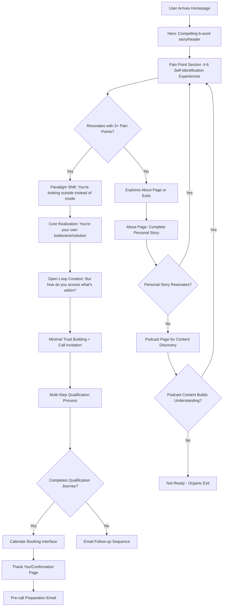

# The Wisdom Practice Website UI/UX Specification

**Generated by:** UX Expert (Sally)  
**Date:** 2025-01-17  
**Project:** TWP_website  
**Methodology:** Enhanced BMAD

This document defines the user experience goals, information architecture, user flows, and visual design specifications for The Wisdom Practice website's user interface. It serves as the foundation for visual design and frontend development, ensuring a cohesive and user-centered experience.

## Overall UX Goals & Principles

### Target User Personas

**Primary Persona: The Over-Educated Seeker (Male, 18-30)**
- Highly invested in personal development but stuck despite extensive learning
- Experiences "learning addiction" - constantly consuming courses, books, routines without lasting change
- Has glimpses of their ideal self but can't consistently access that state
- Intellectually sophisticated but frustrated by lack of real-world results
- Performing authenticity rather than embodying it, especially in social situations
- Knows courses don't work but keeps hoping the next one will be different

**Secondary Persona: The Podcast Discovery User (Male, 25-35)**
- Discovers through content before engaging with main conversion flow
- Values depth and authentic approach over typical coaching promises
- Uses podcast content to assess coach's understanding and methodology

### Core Usability Goals

1. **Pattern Recognition & Redirection (30 seconds):** Users recognize their "learning addiction" pattern and understand WHY they're stuck - shift from "I need more information" to "I've been focusing on learning, not integrating"

2. **Paradigm Shift Realization (First scroll):** Users understand this is category-of-one - not another course but completely different approach that accesses what's already within them

3. **Internal Authority Awakening (Throughout qualification):** Users begin sensing they already have what they need inside - it's about accessing and letting go, not acquiring more

4. **Subtle Pattern Callout (Hero section):** Interface hints their current approach (courses/routines/optimization) isn't working without direct confrontation - they already know this

5. **Leverage Drive for Action (Qualification to booking):** Use their pain and drive for change to motivate call booking - don't pacify their current position but redirect their energy inward

6. **Self-Discovery Through Qualification (Multi-step process):** Qualification feels like guided introspection that helps them understand core patterns - learning experience regardless of booking outcome

### Design Principles

1. **Paradigm Disruption** - Challenge the "learning more" model and redirect to "accessing what's within"
2. **Sophisticated Redirection** - Authority through insight, not credentials - understand their patterns better than they do
3. **Internal Authority Building** - Every element guides them inward rather than toward external solutions
4. **Category of One** - Design feels completely different from courses/programs they've tried
5. **Leverage Without Pacification** - Use their drive for change while redirecting the energy from external to internal focus

## Information Architecture (IA)

### Site Map / Screen Inventory

```mermaid
graph TD
    A[Homepage - Single Page Flow] --> B[Hero: Compelling 6-word story]
    A --> C[Pain Point Recognition List]  
    A --> D[Paradigm Shift Section]
    A --> E[Solution Understanding]
    A --> F[Minimal Trust Building]
    A --> G[Qualification Funnel - Multi-Step]
    A --> H[Calendar Booking Integration]
    
    I[About Page] --> I1[Complete Personal Story]
    I --> I2[Credibility Building]
    I --> I3[Back to Main CTA]
    
    J[Podcast Page] --> J1[Spotify Integration]
    J --> J2[Episode Showcase]
    J --> J3[Subtle CTA Back to Main]
    
    K[Thank You/Confirmation] --> K1[Booking Confirmation]
    K --> K2[Call Preparation Instructions]
    K --> K3[Expectation Setting]
    
    L[Legal Pages] --> L1[Privacy Policy]
    L --> L2[Terms of Service]
    L --> L3[GDPR Compliance]
```

### Navigation Structure

**Primary Navigation (Header):**
- Logo (refresh homepage)
- How This Works (anchor link to paradigm shift section - supports "category of one" understanding)
- About (backup engagement for users needing more context)
- Podcast (content discovery separate from main conversion)

**Conversion Flow Anchor Links (Invisible to Users):**
- #mirror-moment (hero section)
- #recognition (pain point identification)  
- #paradigm-shift (solution understanding - "How This Works" destination)
- #qualification (multi-step form beginning)
- #booking (calendar integration)

**Secondary Navigation (Footer Only):**
- Privacy Policy, Terms of Service (GDPR compliance)
- Contact Information (minimal - focus remains on booking flow)

**Mobile Navigation Strategy:**
- Hamburger menu with clear visual hierarchy
- Touch-optimized anchor scrolling between sections
- Progressive disclosure in qualification form optimized for mobile completion

**Breadcrumb Strategy:** Not implemented - single page focus maintains linear progression without need for breadcrumb navigation

## User Flows

### Primary User Flow: Discovery to Booking

**User Goal:** Move from external solution seeking (courses/techniques) to internal readiness assessment for authentic self-access work

**Entry Points:** 
- Organic search (personal development, masculine development, coaching)
- Podcast discovery and referral to main conversion
- Word-of-mouth from previous clients or similar communities

**Success Criteria:** 
- Strong identification with multiple pain points (3+ out of 4-6 listed experiences)
- Paradigm shift recognition: "I've been looking outside instead of inside"
- Completes qualification process showing readiness for internal work
- Books consultation call with understanding this is category-of-one approach

#### Flow Diagram

#### Edge Cases & Error Handling:

- **Partial Resonance:** Users identifying with 2-3 pain points still continue due to intensity of recognition
- **Technical Failures:** Form submission issues redirect to simple contact form with coach notification
- **Mobile Interruptions:** Auto-save qualification progress with 30-minute session recovery
- **Calendar Conflicts:** Real-time availability with alternative scheduling options
- **Wrong Audience Early Exit:** Clear early indicators help non-target users self-select out
- **Qualification Abandonment:** Email capture enables paradigm shift content follow-up sequence

## Wireframes & Mockups

### Key Screen Layouts

#### Screen 1: Homepage - Hero Section
**Purpose:** Create immediate intrigue without revealing solution, drawing sophisticated audience into psychological journey

**Key Elements:**
- Compelling 6-word story or attention-grabbing headline (psychology-focused, not promise-based)
- Minimal navigation: Logo | How This Works | About | Podcast  
- Clean typography hierarchy emphasizing content over visual flourish
- Mobile-first single column layout with strategic white space
- Subtle scroll indicator guiding to pain point section

**Interaction Notes:** Hero avoids typical coaching promises/guarantees - creates curiosity through sophisticated psychological understanding rather than transformation claims

#### Screen 2: Homepage - Pain Point Identification Section
**Purpose:** Generate intense "that's exactly me" recognition through 4-6 specific psychological experiences

**Key Elements:**
- Linear mobile-first layout - single column progression
- 4-6 pain point descriptions covering learning addiction + authenticity disconnect
- Clean, intimate typography optimized for mobile reading
- Minimal visual elements - psychological content drives experience
- Strategic spacing between pain points for processing time

**Interaction Notes:** Should feel like reading personal journal entries - intimate recognition without overwhelming detail. No competing CTAs or sidebar distractions.

#### Screen 3: Multi-Step Qualification Process
**Purpose:** Filter readiness for internal work while providing self-discovery value regardless of booking outcome

**Key Elements:**
- Progressive disclosure across 4-5 steps
- Mobile-optimized form fields with appropriate input types
- Progress indicators encouraging completion
- Auto-save functionality with session recovery
- Clear, non-threatening question presentation

**Interaction Notes:** Should feel like guided self-reflection rather than sales qualification. Each step increases psychological investment while providing genuine insight.

## Component Library / Design System

### Design System Approach
**Design System Approach:** Custom component library optimized for "masculine mindfulness" aesthetic - sophisticated psychological content consumption with charcoal/rust Buddhist-inspired color palette, avoiding typical coaching website clichés while maintaining premium positioning for intelligent, skeptical audience.

### Core Components

#### Component 1: Pain Point Recognition Card
**Purpose:** Present psychological experiences for intimate "that's exactly me" identification moments

**Variants:** 
- Standard experience description
- Paradigm shift insight  
- Open loop question

**States:** Default, reading focus, completed recognition

**Usage Guidelines:** Masculine Headspace aesthetic - darker, robust yet flowy. Support contemplative reading vs quick scanning.

#### Component 2: Navigation System
**Purpose:** Minimal, sophisticated navigation supporting single conversion path

**Variants:** Logo, "How This Works" anchor, About page link, Podcast page link

**States:** Default, active section, mobile collapsed

**Usage Guidelines:** Category disruption - avoid typical "Services/Programs" coaching navigation

## Branding & Style Guide

### Visual Identity
**Brand Guidelines:** Charcoal black, rust, beige/sand palette inspired by Buddhist mindfulness traditions, masculine sophistication avoiding typical coaching aesthetics

### Color Palette
| Color Type | Hex Code | Usage |
|-----------|----------|--------|
| Primary | #2C2C2C | Charcoal black for grounding, sophistication, main text |
| Secondary | #B85450 | Rust for warmth, Buddhist inspiration, accent elements |
| Tertiary | #F5E6D3 | Beige/sand for calm backgrounds, subtle contrast |
| Success | #4A7C59 | Deep forest green for positive feedback, confirmations |
| Warning | #D4A574 | Muted gold for cautions, important notices |
| Error | #8B4B47 | Deep rust variant for errors, validation messages |
| Neutral | #6B6B6B, #A8A8A8 | Text hierarchy, borders, subtle backgrounds |

### Typography

#### Font Families
- **Primary:** Inter or System UI - optimized for psychological content reading on mobile
- **Secondary:** Clean, sophisticated sans-serif for headers avoiding luxury coaching clichés  
- **Monospace:** JetBrains Mono for technical elements

#### Type Scale
| Element | Size | Weight | Line Height |
|---------|------|--------|-------------|
| H1 | 2.5rem | 600 | 1.2 |
| H2 | 2rem | 500 | 1.3 |
| H3 | 1.5rem | 500 | 1.4 |
| Body | 1rem | 400 | 1.6 |
| Small | 0.875rem | 400 | 1.5 |

### Iconography
**Icon Library:** Feather Icons or Lucide React - minimal, sophisticated icons supporting contemplative aesthetic

**Usage Guidelines:** Subtle, functional icons that don't compete with psychological content focus

### Spacing & Layout
**Grid System:** 12-column responsive grid with mobile-first breakpoints

**Spacing Scale:** 8px base unit (8, 16, 24, 32, 48, 64, 96px) for consistent rhythm

## Accessibility Requirements

### Compliance Target
**Standard:** WCAG AA compliance within masculine brand aesthetic

### Key Requirements

**Visual:**
- Color contrast ratios: 4.5:1 minimum for normal text, 3:1 for large text
- Focus indicators: Visible focus outlines using rust accent color
- Text sizing: Minimum 16px base size, scalable to 200%

**Interaction:**
- Keyboard navigation: Full site navigable without mouse
- Screen reader support: Semantic HTML and ARIA labels
- Touch targets: Minimum 44px clickable areas on mobile

**Content:**
- Alternative text: Descriptive alt text for any images used
- Heading structure: Logical H1-H6 hierarchy
- Form labels: Clear, descriptive form field labels

## Responsiveness Strategy

### Breakpoints
| Breakpoint | Min Width | Max Width | Target Devices |
|------------|-----------|-----------|----------------|
| Mobile | 320px | 767px | iPhone, Android phones |
| Tablet | 768px | 1023px | iPad, Android tablets |
| Desktop | 1024px | 1439px | Laptops, small desktops |
| Wide | 1440px | - | Large monitors, wide screens |

### Adaptation Patterns

**Layout Changes:** Single column mobile, progressive multi-column on larger screens

**Navigation Changes:** Hamburger menu mobile, horizontal navigation desktop

**Content Priority:** Most important psychological content prioritized in mobile layout

**Interaction Changes:** Touch-optimized mobile, hover states desktop

## Animation & Micro-interactions

### Motion Principles
Subtle, contemplative animations that support psychological processing rather than distract from content focus. Smooth transitions between qualification steps, gentle scroll reveals for pain point recognition.

### Key Animations
- **Scroll Reveal:** Pain point cards fade in progressively (Duration: 0.6s, Easing: ease-out)
- **Form Transitions:** Qualification steps slide smoothly (Duration: 0.4s, Easing: ease-in-out)  
- **Button Hover:** Subtle color transitions (Duration: 0.2s, Easing: ease)

## Performance Considerations

### Performance Goals
- **Page Load:** < 2s initial load, < 1s subsequent navigation
- **Interaction Response:** < 100ms for form interactions
- **Animation FPS:** 60fps for all micro-interactions

### Design Strategies
Minimal imagery, optimized typography loading, efficient CSS animations, progressive enhancement approach

## Next Steps

### Immediate Actions
1. Complete technical architecture planning with Development team
2. Create detailed visual designs in Figma based on this specification
3. Begin component development with mobile-first approach
4. Set up testing framework for qualification funnel optimization

### Design Handoff Checklist
- [x] All user flows documented
- [x] Component inventory complete  
- [x] Accessibility requirements defined
- [x] Responsive strategy clear
- [x] Brand guidelines incorporated
- [x] Performance goals established

---

**UX Specification Complete**  
**Ready for:** Architecture phase with detailed technical implementation planning